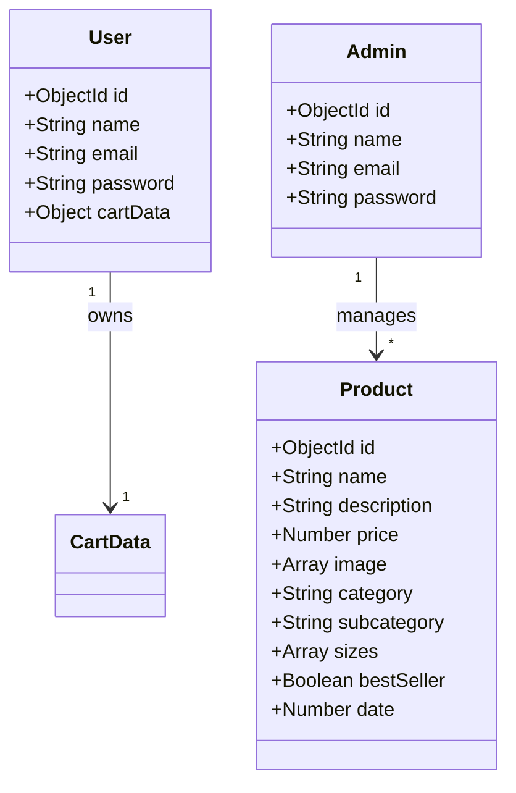

# Cadence Mart - Domain Architecture & Entity Model

This document outlines the current business entities, their structures, constraints, relationships, and drafts integration strategies for advanced e-commerce components.

---

## 1. Current Business Entities

### User Entity

- **Domain Responsibilities**: Represents register customers, manages authentication details, and hosts active cart contents.
- **DTO Mappings (`UserDTO`)**: Normalizes database IDs, exposes `name` and `email` properties, and strips password hashes to prevent leaks.

### Admin Entity

- **Domain Responsibilities**: Represents store managers, controls administrative catalog management.
- **DTO Mappings (`AdminDTO`)**: Normalizes document structures.

### Product Entity

- **Domain Responsibilities**: Exposes item details, pricing, tags, and category classifications.
- **DTO Mappings (`ProductDTO`)**: Normalizes product schemas and resolves standard `description` and legacy `discription` fields dynamically.

### Cart Entity (Conceptual sub-document)

- **Domain Responsibilities**: Holds shopping bag entries.
- **DTO Mappings (`CartDTO`)**: Standardizes item maps (`itemId` ➔ `{ quantity }`).

---

## 2. Future Entity Integrations

The current Service-Repository architecture is structured to support future domain additions without requiring refactoring of existing layers:

### Orders

- **Design Specification**: Create an `Order` model linking a customer to cart items.
- **Integration Flow**:
  1. Once checkouts succeed, the order service reads the customer's DTO cart details.
  2. Copies a snapshot of product prices (protecting orders against future product edits).
  3. Creates an `Order` record, clears the active user's cart repository entries, and raises an `OrderCreated` notification.

### Checkout & Payments

- **Design Specification**: Integrates with external gateways (Stripe/Razorpay) via secure backend endpoints.
- **Integration Flow**:
  1. A checkout handler initializes a secure gateway payment session using the DTO cart total.
  2. The gateway triggers a webhook upon payment completion.
  3. The payment webhook calls the order service to mark the order as paid.

### Inventory System

- **Design Specification**: Track product item stocks per size.
- **Integration Flow**:
  1. Define an `Inventory` model matching `productId` and size arrays to stock integers.
  2. The cart service validates inventory levels before adding items.
  3. Checkout service decrements inventory during order creation.

### Coupons & Discounts

- **Design Specification**: Manage campaign codes.
- **Integration Flow**:
  1. Define a `Coupon` entity (`code`, `discountPercentage`, `maxDiscount`, `expiryDate`).
  2. Cart service checks coupon validity and applies deductions to checkout session requests.

### Reviews

- **Design Specification**: Product ratings.
- **Integration Flow**:
  1. Define a `Review` entity (`userId`, `productId`, `rating`, `comment`).
  2. Expose ratings on `ProductDTO` dynamically by averaging linked product review records.
