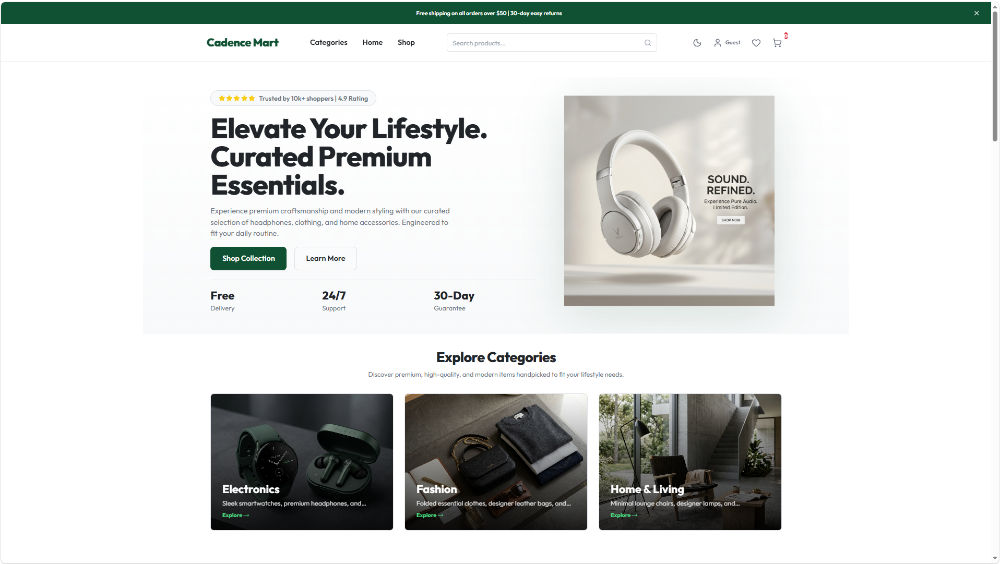
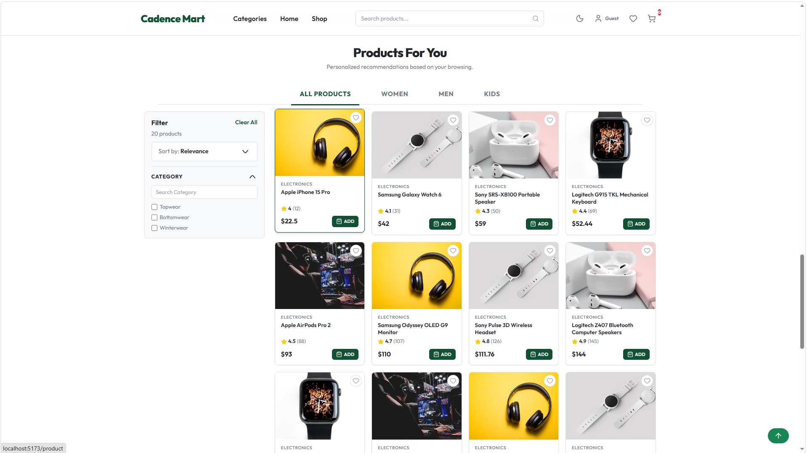
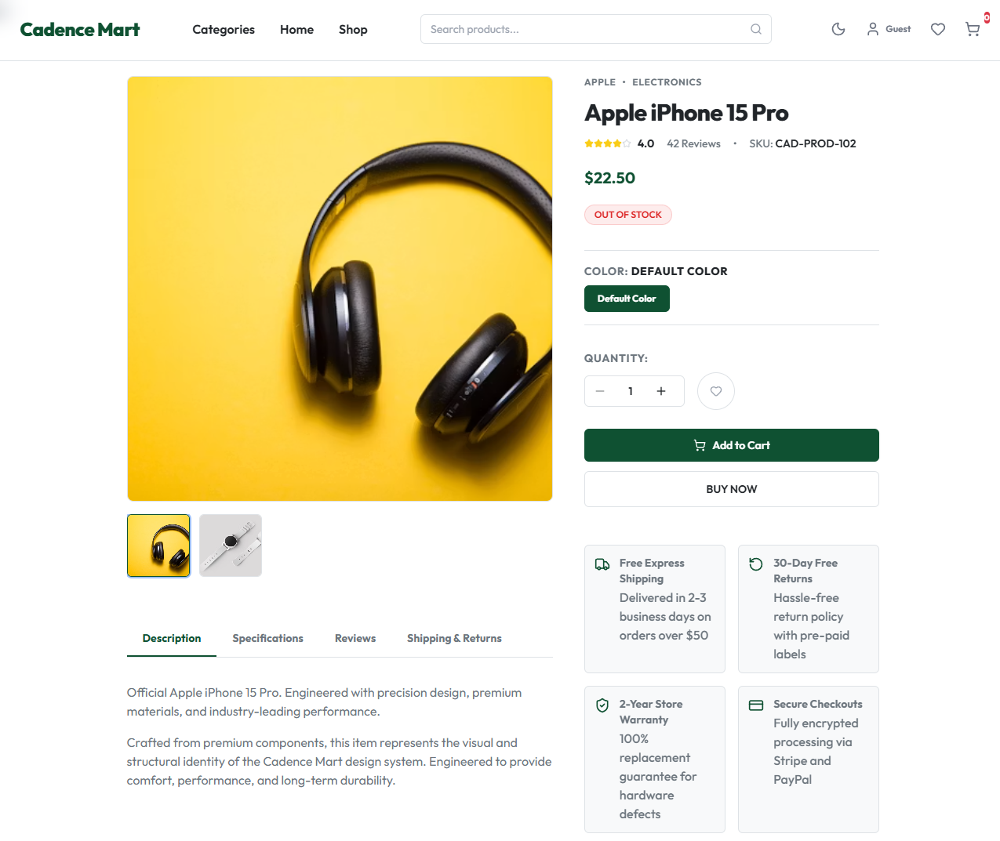
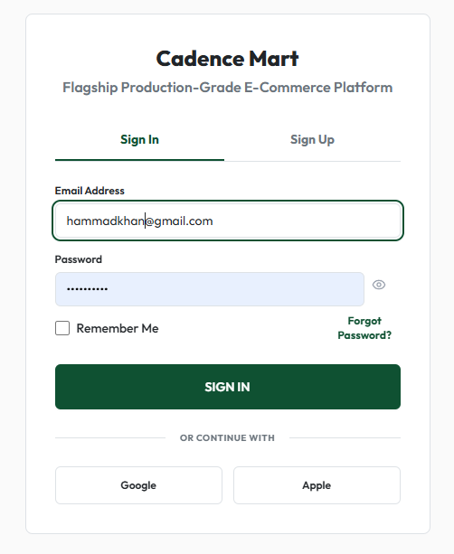
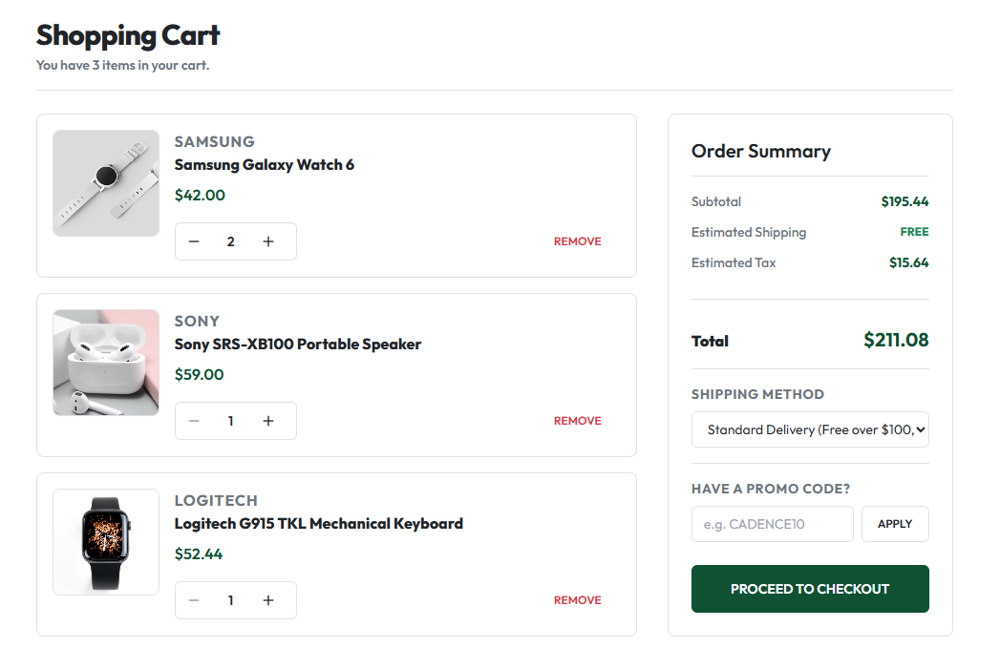
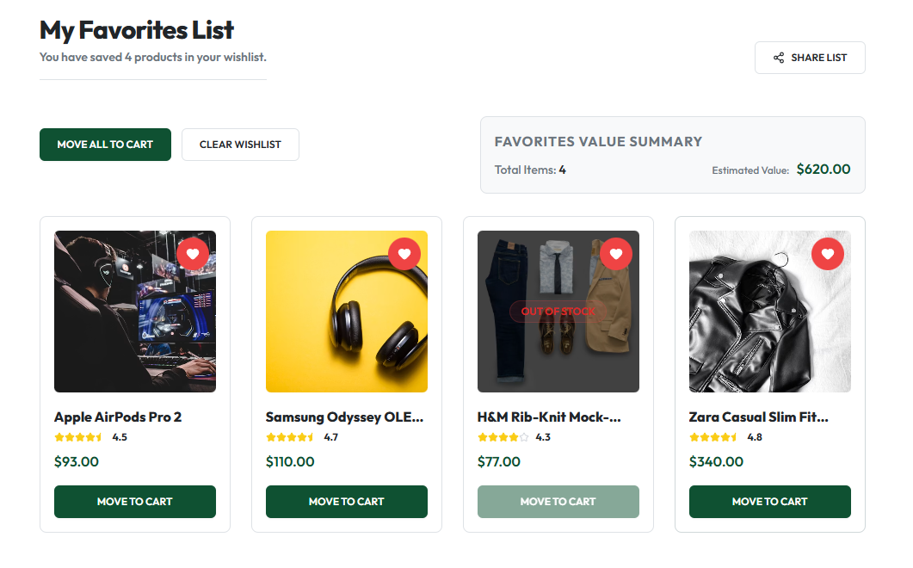
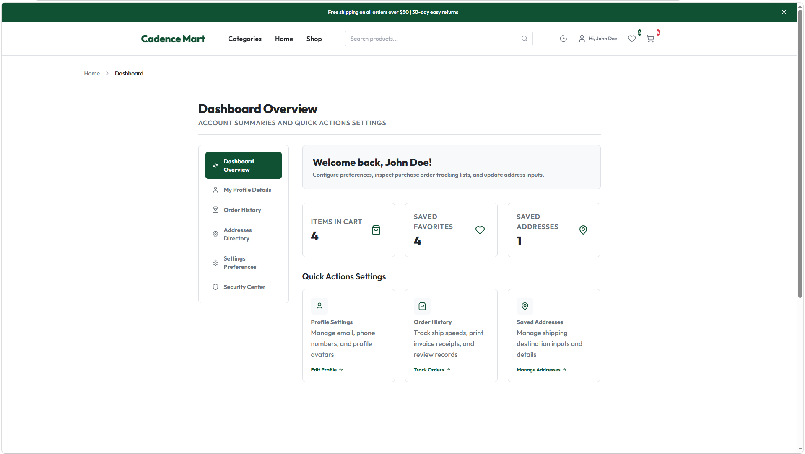
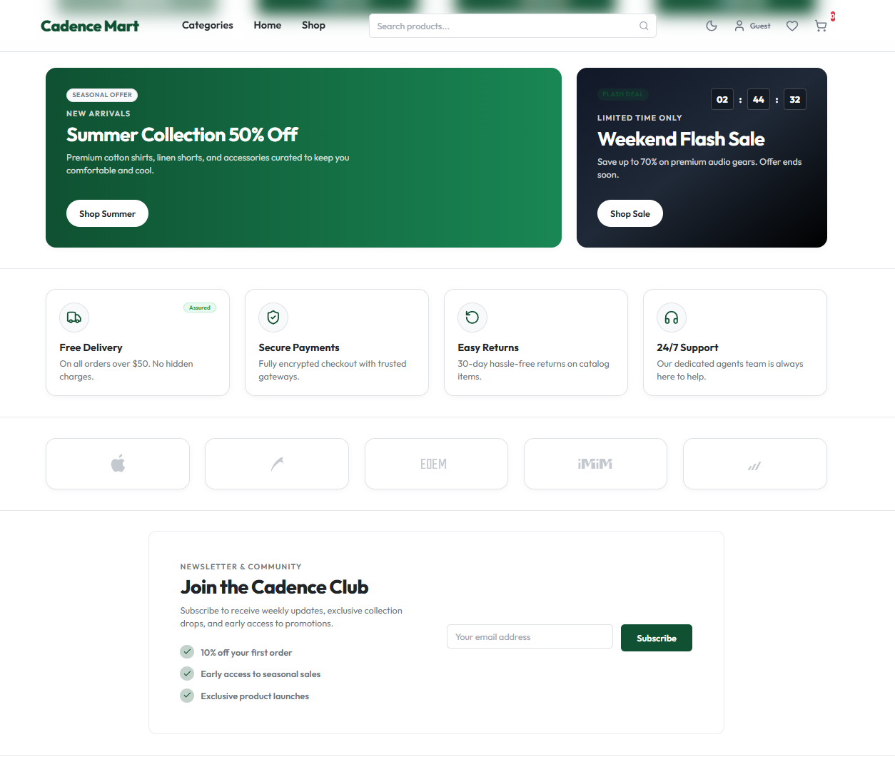

# Cadence Mart

<div align="center">

### Production-Ready MERN E-Commerce Platform

A modern full-stack e-commerce application built with React, Node.js, Express, and MongoDB, designed with scalability, security, and maintainability in mind.


</div>

---

# Overview

Cadence Mart is a production-oriented MERN e-commerce platform developed with an emphasis on clean architecture, secure backend practices, responsive UI, and maintainable code organization.

Unlike tutorial-based projects, this application follows engineering practices commonly used in production environments, including layered architecture, secure authentication, input validation, centralized error handling, and modern frontend architecture.

The application provides a complete shopping experience, including authentication, product discovery, shopping cart management, wishlist functionality, administrative product management, and cloud-based media storage.

---

# Features

## Customer Features

- User Registration & Authentication
- Secure JWT Authentication
- Product Search
- Product Categories
- Product Filters
- Product Details
- Shopping Cart
- Wishlist
- Responsive Design
- Toast Notifications
- Dark/Light Theme

## Administrative Features

- Secure Admin Authentication
- Product Management
- Cloudinary Image Upload
- Inventory Management
- Database Seeding

## Engineering Features

- REST API
- MongoDB Integration
- Context API State Management
- DTO Pattern
- Zod Validation
- Global Error Handling
- Rate Limiting
- Helmet Security
- HPP Protection
- Compression
- Production Environment Configuration

---

# Architecture

```
                React + Vite
                      │
                Axios REST Client
                      │
                 Express Server
                      │
        ┌─────────────┼─────────────┐
        │             │             │
 Authentication   Product API   Cart API
        │             │             │
        └─────────────┼─────────────┘
                      │
                 MongoDB Database
                      │
                 Cloudinary Storage
```

---

# Tech Stack

## Frontend

- React 18
- Vite
- React Router
- Axios
- Tailwind CSS
- Framer Motion
- React Toastify

## Backend

- Node.js
- Express.js
- MongoDB
- Mongoose
- JWT
- bcrypt
- Zod
- Multer
- Cloudinary

---

# Project Structure

```text
Cadence-Mart/
│
├── Backend/
│   ├── config/
│   ├── controllers/
│   ├── middleware/
│   ├── models/
│   ├── routes/
│   ├── services/
│   ├── dto/
│   ├── tests/
│   └── server.js
│
├── Frontend/
│   ├── src/
│   │   ├── app/
│   │   ├── components/
│   │   ├── context/
│   │   ├── hooks/
│   │   ├── pages/
│   │   ├── services/
│   │   ├── styles/
│   │   └── utils/
│   └── public/
│
└── README.md
```

---

# Screenshots

## Home Page



---

## Product Listing



---

## Product Details



---

## Authentication



---

## Shopping Cart



---

## Wishlist



---

## Admin Dashboard



---

## Cadence Club (Community Newsletter)



---

# Getting Started

## Clone

```bash
git clone https://github.com/hammadk-devv/cadence-mart.git

cd cadence-mart
```

## Backend

```bash
cd Backend

npm install

npm run dev
```

## Frontend

```bash
cd Frontend

npm install

npm run dev
```

---

# Environment Variables

Backend

```
PORT=
NODE_ENV=

MONGODB_URI=

JWT_SECRET=

JWT_EXPIRES_IN=

ADMIN_EMAIL=
ADMIN_PASSWORD=

CLOUDINARY_NAME=
CLOUDINARY_API_KEY=
CLOUDINARY_SECRET_KEY=
```

Frontend

```
VITE_BACKEND_URL=
```

---

# Available Scripts

Backend

```bash
npm run dev

npm run test

npm run lint

npm run check
```

Frontend

```bash
npm run dev

npm run build

npm run lint

npm run preview
```

---

# API Overview

| Module | Endpoints |
|---------|-----------|
| Authentication | Register, Login |
| Products | List, Details, Add, Remove |
| Cart | Add, Update, Remove |
| User | Profile |
| Admin | Product Management |

---

# Security

- JWT Authentication
- Password Hashing (bcrypt)
- Helmet
- Rate Limiting
- Zod Input Validation
- NoSQL Injection Protection
- HPP Protection
- CORS Configuration
- Environment Variables
- Secure Error Handling

---

# Testing

The backend includes automated testing using **Vitest**.

Run:

```bash
npm test
```

---

# Performance

- Vite Build Optimization
- MongoDB Indexing
- DTO Pattern
- Response Compression
- Lazy Loading
- Optimized Asset Delivery

---

# Deployment

Frontend

- Vercel

Backend

- Render / Railway

Database

- MongoDB Atlas

Media Storage

- Cloudinary

---

# Roadmap

- Docker Support
- GitHub Actions
- Swagger/OpenAPI
- Sentry Monitoring
- CI/CD Pipeline

---

# License

This project is licensed under the MIT License.

---

# Author

**Hammad Khan**

Software Engineer

LinkedIn: https://www.linkedin.com/in/hammad-khan-a8229a352/

GitHub: https://github.com/hammadk-devv

Portfolio: